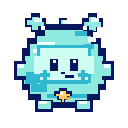

<h1 align="center">Buddy Agent</h1>

<p align="center"><strong>Local-first Buddy runtime, companion shell, and creative workspace toolkit for the Prismtek / Hermes ecosystem.</strong></p>

<table align="center">
  <tr>
    <td align="center" width="50%">
      <br>
      <strong>ASCII Buddy</strong><br>
      <sub>Terminal/docs mascot. Cycles through idle → happy → thinking → sleepy.</sub>
    </td>
    <td align="center" width="50%">
      <br>
      <strong>Pixel Buddy</strong><br>
      <sub>Default mint/cyan avatar matching the app art direction.</sub>
    </td>
  </tr>
</table>

<p align="center">
  <a href="#what-works-today"><strong>What works</strong></a>
  &nbsp;•&nbsp;
  <a href="#what-does-not-work-yet"><strong>What does not work yet</strong></a>
  &nbsp;•&nbsp;
  <a href="#appearance-contract"><strong>Appearance contract</strong></a>
</p>

<p align="center">
  <br>
  <br>
  
</p>

<p align="center">
  <a href="https://github.com/codysumpter-cloud/buddy-agent/archive/refs/heads/main.zip"></a><br>
  <a href="https://github.com/codysumpter-cloud/buddy-agent"></a><br>
  <a href="https://github.com/codysumpter-cloud/buddy-agent/issues"></a>
</p>

## What Buddy Agent is

Buddy Agent is a runnable alpha for a local-first companion runtime. It gives Buddy a CLI, memory, simple skills, training state, appearance templates, integration status checks, and safe workspace helpers without pretending unfinished external automation is production-ready.

The current shape is intentionally conservative:

- local runtime first;
- reviewable files and drafts before external side effects;
- explicit user approval before adapters send, post, browse, mutate repos, or touch accounts;
- honest status labels for native runtime, adapter-ready surfaces, and future work.

## Install

```bash
git clone https://github.com/codysumpter-cloud/buddy-agent.git
cd buddy-agent
python -m venv .venv
source .venv/bin/activate
pip install -e .[dev]

buddy doctor
buddy smoke
buddy alpha
```

## What works today

| Area | Commands / files | Status |
| --- | --- | --- |
| Core CLI | `buddy --help`, `buddy --version`, `buddy doctor`, `buddy status`, `buddy smoke`, `buddy alpha` | Runnable alpha |
| Local chat path | `buddy chat "hello buddy"` | Runnable local Alpha Runtime path |
| Local memory | `buddy remember "..."`, `buddy recall "..."` | JSON-backed local memory |
| Built-in skills | `buddy skill --skill caps "buddy alpha"` | Local skill execution path |
| App bridge seam | `buddy app-chat --surface local "hello"` | Typed local app-chat routing |
| Buddy training loop | `buddy train status`, `buddy train reward <action>`, `buddy train reset` | Local training state, rewards, cosmetics, and AgentCraft event emission |
| AgentCraft bridge | `buddy agentcraft doctor`, `buddy agentcraft smoke`, `buddy agentcraft emit <event> [json]` | Local event bridge helpers |
| Buddy generation | `buddy generate --output my-buddy` | Writes `buddy.json` and `ascii_frames.json` |
| Appearance contract | `docs/BUDDY_APPEARANCE_SPEC.md`, `assets/default-buddy.svg`, `assets/buddy-agent-mascot.svg` | Pixel and ASCII Buddy modes with `idle`, `happy`, `thinking`, and `sleepy` states |
| Integration registry | `buddy integrations`, `buddy integrations describe <target>`, `buddy integrations run <target> <capability>` | Local registry and guarded runtime actions |
| OpenMythos / Buddy Mythos | `buddy integrations run openmythos architecture-contract`, `variant-configs`, `training-script` | Dependency-light model config, variants, backend guard, and plan-only training output |
| Symphony / Buddy Work Orchestrator | `buddy integrations run symphony workflow-contract`, `tracker-local`, `workspace-spawn`, `work-runner`, `observability` | Local workflow parsing, JSON issue loading, workspace planning, prompt/receipt writing |
| Game Studio | `buddy game-studio doctor`, `detect`, `init`, `index` | VS Code cockpit scaffold for Godot/Unity projects |
| Buddy Playground workspace | `buddy-workspace init`, `status`, `code-task`, `art-request`, `browser-note`, `draft-email`, `draft-message`, `draft-calendar`, `file-note` | Reviewable local workspace, notes, drafts, and receipts |

## What does not work yet

These are not bugs; they are explicit alpha boundaries unless a later branch says otherwise.

| Area | Current boundary |
| --- | --- |
| Full autonomous operator | Not shipped. Buddy does not get unchecked authority to act across accounts or devices. |
| External side effects | Email, messages, calendar events, browser sessions, posts, purchases, money movement, and destructive changes are draft-only or adapter-gated. |
| Hermes full parity | The integration is tracked, but full Hermes provider/tool/skill parity is not complete. |
| Codex app-server | Symphony can plan local work and write prompts/receipts, but it does not auto-launch Codex app-server. |
| Remote trackers | Symphony uses local JSON tracker flows today; remote tracker adapters require explicit config/secrets/approval. |
| OpenMythos heavy training | Default install does not run model training. The training command is plan-only; real Torch work belongs behind optional `[mythos]` flows. |
| Browser/app automation | Live browser control and connected-account operations are not enabled by default. |
| Public release completion | Public-alpha governance work exists in separate PR history; do not treat the release checklist as complete until checks and secret scans are actually run. |

## Appearance contract

The default Buddy should match the attached Buddy reference style:

- round mint/cyan pixel-pet body;
- deep navy high-contrast pixel outline;
- large soft face panel with tiny dot eyes, small smile, blush/plus cheeks;
- heart-shaped antler/ear nubs, small top tuft, tiny side arms, tiny feet;
- gold heart belly charm;
- crisp pixel clusters, no blurry painterly rendering, no 3D mascot styling;
- transparent sprite background for app assets;
- centered 64x64 frame contract for generated Buddy templates.

A Buddy is the living companion. The phone, web app, terminal, or HUD is the device. Do not draw the default Buddy as a screen body, phone, gamepad, or device-shaped character.

ASCII Buddy and Pixel Buddy must share the same required states:

```text
idle -> happy -> thinking -> sleepy -> repeat
```

The README ASCII mascot now uses SVG-native SMIL frame opacity animation instead of CSS keyframes, because GitHub image rendering is more reliable with inline SVG animation than stylesheet keyframes.

## Alpha Runtime

```bash
buddy chat "hello buddy"
buddy remember "Buddy can keep local notes"
buddy recall "local"
buddy skill --skill caps "buddy alpha"
buddy app-chat --surface local "hello from the app"
```

The Alpha Runtime wires local chat routing, persistent memory, built-in skills, Buddy template validation, and companion permission policy into one runnable path.

## Buddy training

```bash
buddy train status
buddy train reward skill_used
buddy train reset
```

Training stores local Buddy state and can award XP, sparks, snacks, levels, achievements, and cosmetics. It is a local gamified companion loop, not a remote profile sync service.

## Generate a Buddy

```bash
buddy generate --output my-buddy
```

Generated Buddies include:

- `buddy.json`
- `ascii_frames.json`

Generated Buddies support pixel and ASCII render modes, idle/happy/thinking/sleepy states, an animation cycle contract, and a centered 64x64 frame contract.

## Priority integrations

```bash
buddy integrations
buddy integrations describe hermes-agent
buddy integrations describe openmythos
buddy integrations describe symphony

buddy integrations run openmythos architecture-contract
buddy integrations run openmythos architecture-contract buddy-mythos-3b
buddy integrations run openmythos variant-configs
buddy integrations run openmythos torch-model
buddy integrations run openmythos training-script buddy-mythos-1b

buddy integrations run symphony workflow-contract examples/symphony/WORKFLOW.md
buddy integrations run symphony tracker-local examples/symphony/issues.json
buddy integrations run symphony workspace-spawn examples/symphony/WORKFLOW.md
buddy integrations run symphony work-runner examples/symphony/WORKFLOW.md
buddy integrations run symphony observability
buddy integrations run symphony codex-app-server
```

See [`docs/PRIORITY_INTEGRATIONS_STATUS.md`](docs/PRIORITY_INTEGRATIONS_STATUS.md) for exact native-runtime vs adapter-ready status.

## Buddy Game Studio

Use VS Code as a dev cockpit for Godot or Unity while the game engine stays the source of truth for scenes, inspectors, prefabs, animation, imports, exports, and play mode.

```bash
buddy game-studio doctor ./my-game
buddy game-studio detect ./my-game
buddy game-studio init ./my-game godot
buddy game-studio init ./my-game unity
buddy game-studio index ./my-game
```

`buddy game-studio init` writes a reviewable `.vscode/` scaffold with recommended extensions, settings, tasks, launch config, and workspace notes. Existing files are skipped by default. `buddy game-studio index` creates compact JSON project context while ignoring engine caches such as `.buddy`, `.godot`, `Library`, `Temp`, `Obj`, `Build`, `Logs`, `.vscode`, `node_modules`, and `.git`.

See [`docs/BUDDY_GAME_STUDIO.md`](docs/BUDDY_GAME_STUDIO.md) for the full workflow and guardrails.

## Buddy Playground workspace

The standalone `buddy-workspace` command creates a local `.buddy/playground/` sandbox inside a project.

```bash
buddy-workspace init ./my-game
buddy-workspace status ./my-game
buddy-workspace code-task ./my-game "Build browser shell" "Create the first browser workspace plan."
buddy-workspace art-request ./my-game "Buddy idle sprite" "Draft a crisp 64x64 pixel sprite brief."
buddy-workspace browser-note ./my-game "Research note" "Save notes locally; do not browse automatically."
buddy-workspace draft-email ./my-game "Update" "Draft only; do not send."
buddy-workspace draft-message ./my-game "Community post" "Draft only; do not post."
buddy-workspace draft-calendar ./my-game "Planning call" "Draft only; do not create event."
buddy-workspace file-note ./my-game "Patch plan" "Save a local implementation note."
```

The important split is **draft vs action**. Drafts are allowed locally. External side effects require an approved adapter and user confirmation.

## Version tracker

| Track | Status |
| --- | --- |
| Runtime |  runnable alpha |
| Package | `0.1.0` alpha scaffold |
| CLI | `buddy` plus `buddy-workspace` |
| Memory | persistent JSON-backed local memory |
| Skills | local built-in skill path |
| Training | local companion progression state |
| AgentCraft | local event bridge helpers |
| Appearance | pixel and ASCII Buddy modes; README shows both visibly |
| Companion | consent-first contracts started |
| iBeMore | typed app bridge contracts started |
| Integrations | Hermes mapped/adapter-ready; OpenMythos and Symphony local native-runtime slices |
| Game Studio | VS Code + Godot/Unity cockpit scaffold |
| Playground | local `.buddy/playground/` drafts, notes, and receipts |

## Development

```bash
python -m pytest tests/test_integrations.py tests/test_game_studio.py tests/test_workspace.py
python -m pytest
python -m ruff check src tests
python -m mypy src/buddy_agent

buddy --help
buddy doctor
buddy smoke
buddy alpha
buddy generate --output my-buddy
buddy integrations
buddy game-studio doctor .
buddy game-studio index .
buddy-workspace init .
buddy-workspace status .
```
